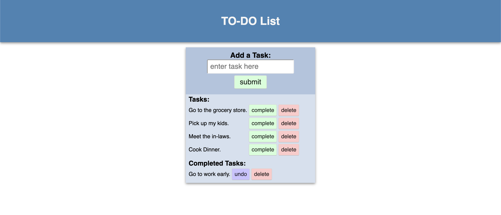

# SQL TO-DO LIST

## Description

_Duration: Weekend Challenge_

This app is a todo list that uses ajax calls to communicate with a database. Tasks are stored and updated on that database and can be marked as completed or deleted from the database.

## Screen Shot

### Prerequisites

- [Node.js](https://nodejs.org/en/)
- [Postgres](https://www.postgresql.org/download/)

## Installation

1. Create a database named `weekend-to-do-app`,
2. Run the queries in `database.sql`
3. Open the directory in vscode or similar editor and run the command `npm install`
4. Run `npm start` to start the server.

## Usage

1. Enter a task in the add task field.
2. Once submitted you can:
   1. Mark the task as completed.
   2. Undo a completion.
   3. Delete a task.

## License

[MIT](./LICENSE.txt)

## Acknowledgement

Thanks to [Prime Digital Academy](www.primeacademy.io) who equipped and helped me to make this application a reality. (Thank your people)
